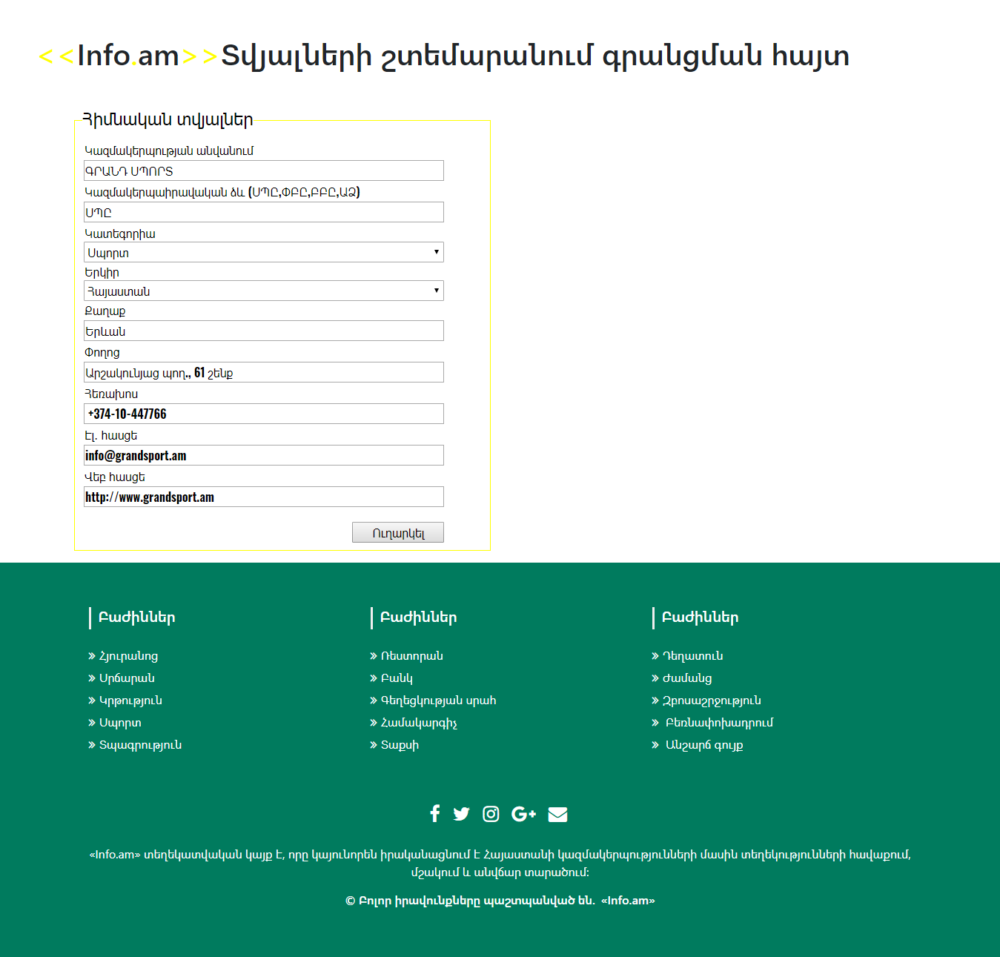
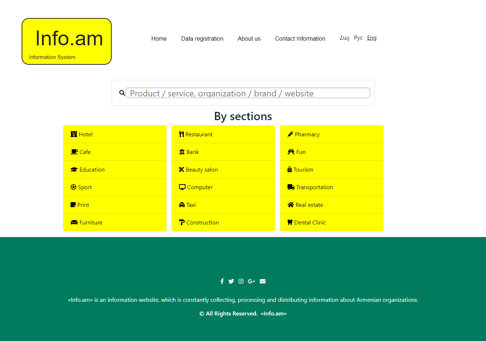
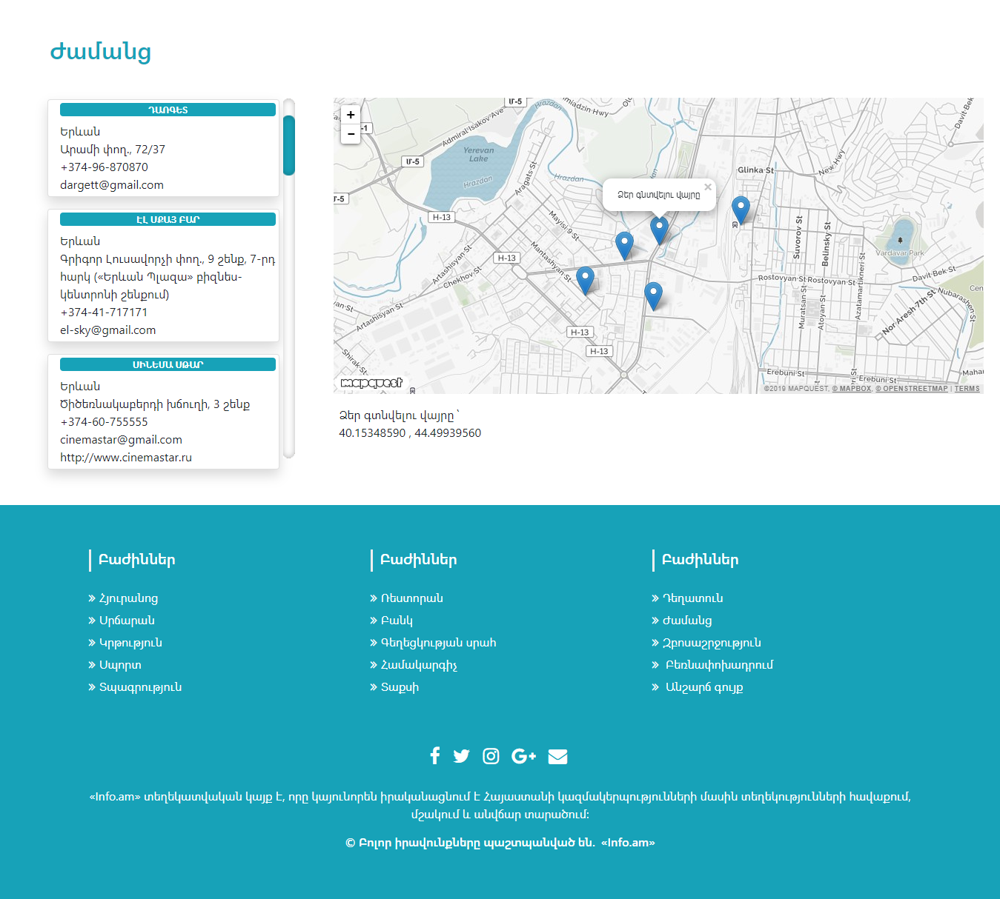

# Diploma thesis made for my fellow student

«Info.am» is an information website, which is constantly collecting, processing and distributing information about Armenian organizations

## Getting Started

These instructions will get you a copy of the project up and running on your local machine for development purposes.

### Prerequisites

* Install XAMPP Control Panel

* run Apache and MySQL modules

    * Apache start
    * MySQL start

### Installing

Install all dependencies
```
npm i 
```

Just execute node server.js in the root directory or run script npm start

```
node server.js 
```

server runing on prot 8080

```
open in browser http://localhost:8080/
```

### Some project images 



## License

This project is licensed under the MIT License


